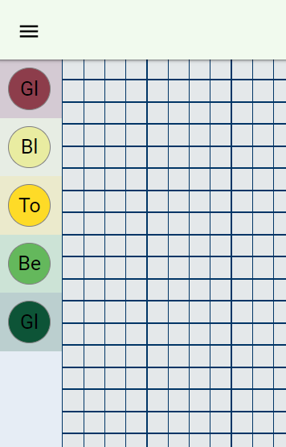
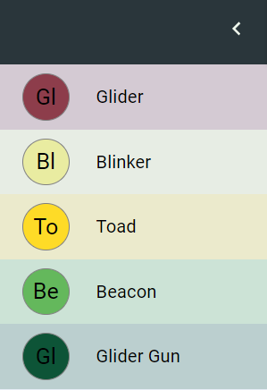
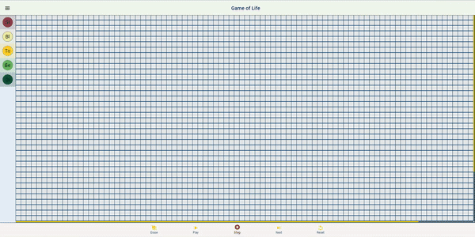

# Game Of Life !
The Game of Life, also known simply as Life, is a cellular automaton devised by the British mathematician John Horton Conway in 1970. It is a zero-player game, meaning that its evolution is determined by its initial state, requiring no further input. One interacts with the Game of Life by creating an initial configuration and observing how it evolves. It is Turing complete and can simulate a universal constructor or any other Turing machine.

## Currently Available Features

- Few Popular options to select from in the collapsible bar (more to be added in the future...)

  
  

- Select Pre-made cellular state by **drag and drop** to apply them on to the grid.

| Feature   | Description                       |
| :-------- | :-------------------------------- |
| `Play`    | Option to start your automaton once you have applied it to the grid |
| `Pause`    | Option to stop the automaton |
| `Erase`    | Remove cellular state which was once attached |
| `Reset`    | Option to reset your automaton with a blank canvas |
| `Next`    | Interate to the next generation of the automaton |

## Features to Be Excited About
| Feature   | Description                       |
| :-------- | :-------------------------------- |
| `Snippet Selection`    | Ability to highlight a part of snippet and apply save them |
| `Upload Snippet`    | Ability to upload the saved snippet on to the sidebar |
| `Undo and Redo`    | Undo the applied state |
| `Theme Selection`    | Ability to change Theme |

## Browser

[Game of Life](https://sher208.github.io/GameOfLife/)
## License

[MIT](https://choosealicense.com/licenses/mit/)